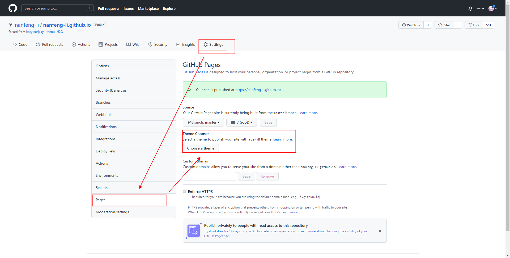
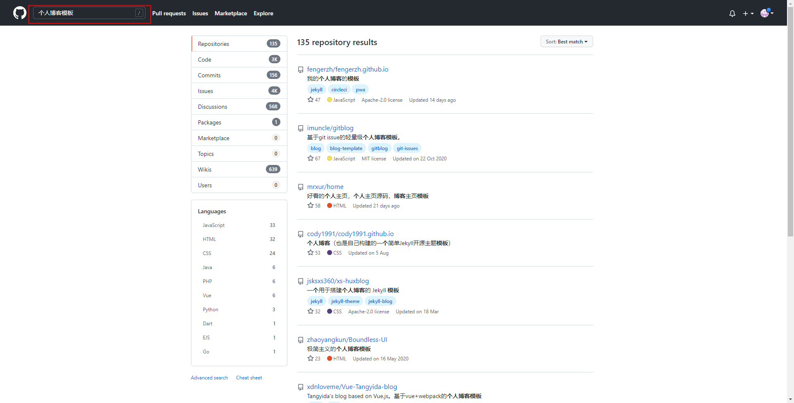
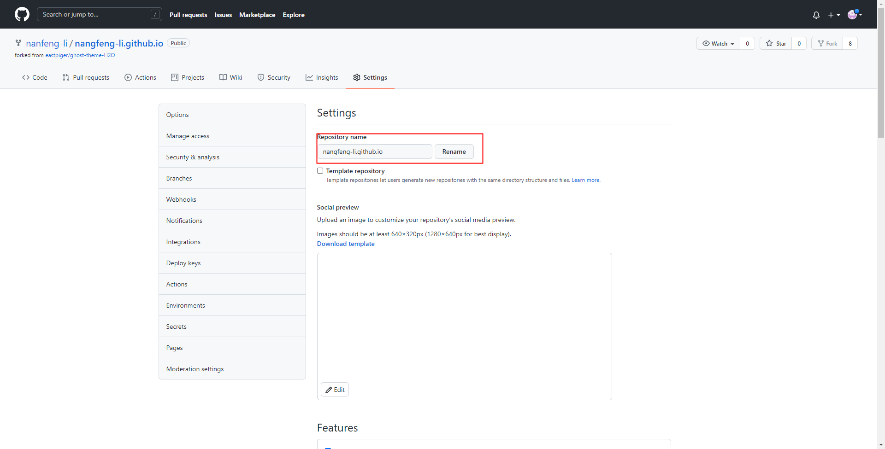
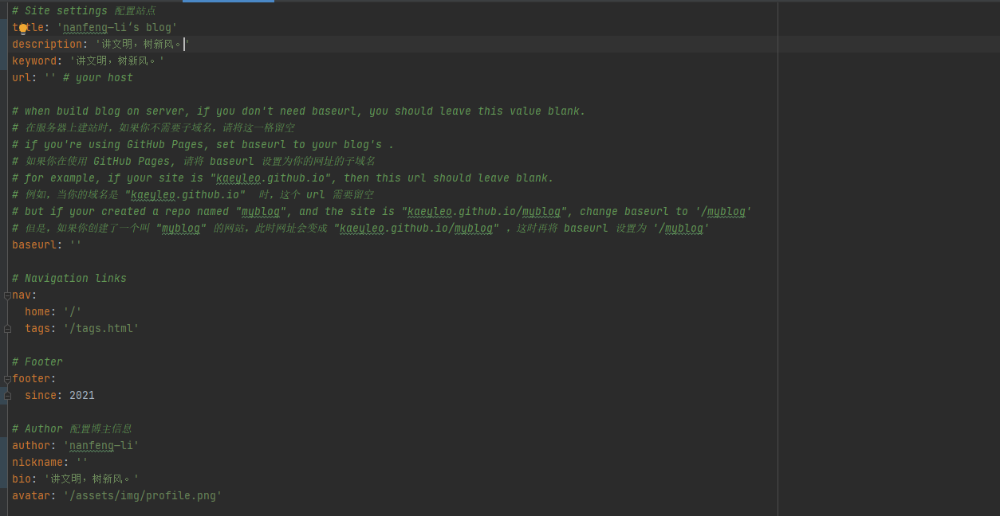

#一，选择模板
1，在[Jekyll Themes](http://jekyllthemes.org/) 或者[jekyll sites](https://github.com/jekyll/jekyll/wiki/Sites) 选择一个你喜欢的模板直接下载。

2，在github新建一个项目,选择一个主题。

3，在github上搜索：个人博客模板，选择喜欢的模板fork或clone。

#二， [H2O](https://github.com/kaeyleo/jekyll-theme-H2O) 

1，修改设置

1.1，重命名

1.2，修改_config.yml 文件

2，查看效果
[https://nanfeng-li.github.io/](https://nanfeng-li.github.io/)

